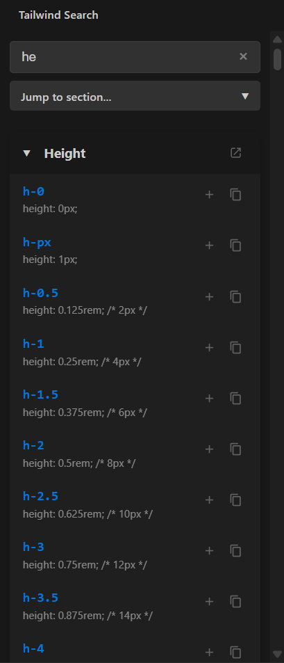
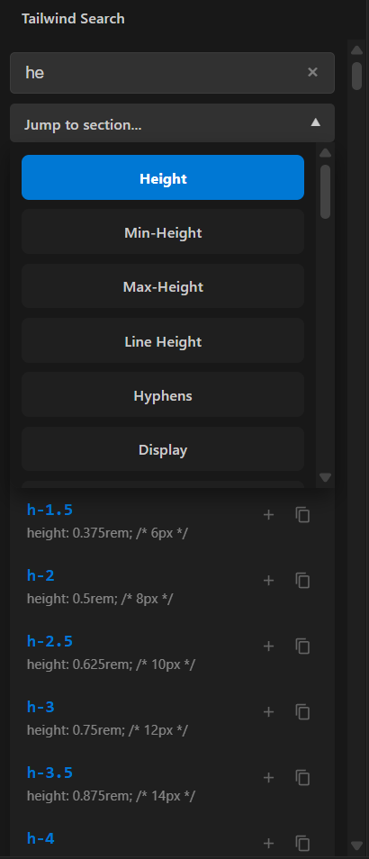

# Tailwind Search

**Tailwind Search** is a powerful and intuitive Visual Studio Code extension designed to streamline your Tailwind CSS workflow. It provides a beautiful, native-feeling sidebar to explore classes, alongside high-performance IntelliSense that delivers suggestions directly in your code editor.

## Key Features

- 🔍 **Fuzzy Search**: Find exactly what you need with an advanced fuzzy search algorithm that handles typos and ranks results by relevance.
- 🚀 **Built-in IntelliSense**: Get instant Tailwind class suggestions as you type in HTML, JS, TS, React, Vue, and Svelte files.
- 📍 **Quick Navigation**: Use the "Jump to section" dropdown to skip directly to specific categories like Padding, Colors, or Typography.

- 🗃️ **Premium Card UI**: Browsing is easier than ever with our modern card-based design, featuring collapsible sections and clear category headers.
- 🕒 **Recently Used**: Access your most frequent classes in a dedicated "Recently Used" section for lightning-fast styling.
- ✨ **Direct Actions**:
  - **Copy**: One-click copy to clipboard.
  - **Insert**: Insert the class directly at your cursor position in the active editor.
  - **Official Docs**: Access the official Tailwind documentation page for any class instantly.
- 🎨 **Auto-Theme Matching**: No setup required! The extension automatically matches your VS Code theme (Dark, Light, or High Contrast) for a seamless experience.

## Usage

### Using the Sidebar
1. Click the **Tailwind icon** in the Activity Bar on the left.
2. Type in the search box to find utility classes.
3. Use the **Jump to section** dropdown to navigate between categories.
4. Click the **+** icon to insert a class, or the **copy icon** to save it to your clipboard.
5. Click the **External Link icon** (⇱) in any card header to open official documentation.

### Using IntelliSense
1. Open any supported file type (`.html`, `.js`, `.jsx`, `.ts`, `.tsx`, `.vue`, `.svelte`).
2. Start typing `class="` or `className="`.
3. Type a few characters (e.g., `h-` or `bg-`) and suggestions will appear automatically.
4. View real-time CSS property details for every suggestion in the list.

## Recent History
- The "Recently Used" section tracks your last 5 used classes.
- Click a chip to quickly insert it again.
- Clear your history anytime using the **Trash Icon** in the recent header.

---
### Installation

1. Open **VS Code**.
2. Go to the **Extensions view** (`Ctrl+Shift+X`).
3. Search for **"Tailwind Search"**.
4. Click **Install**.

---

## License

This project is licensed under the MIT License - see the [LICENSE](LICENSE) file for details.

---

## Acknowledgements

- Thanks to the [Tailwind CSS](https://tailwindcss.com/) team for their incredible utility-first CSS framework.
- Built with ❤️ for the Tailwind community.

For any issues or feature requests, please visit our [Issues page](https://github.com/soubhagya2001/tailwind-search/issues).
